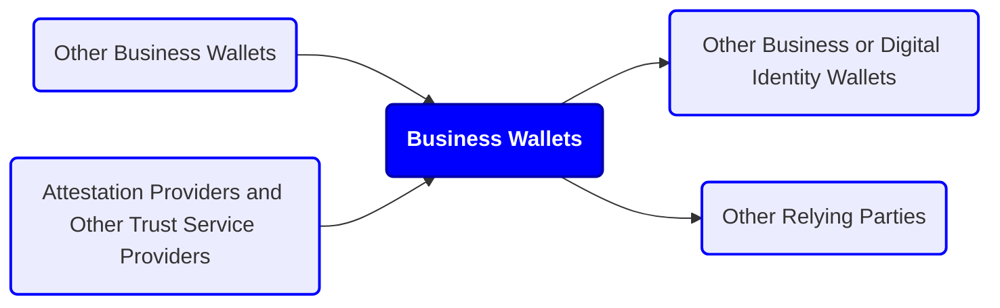
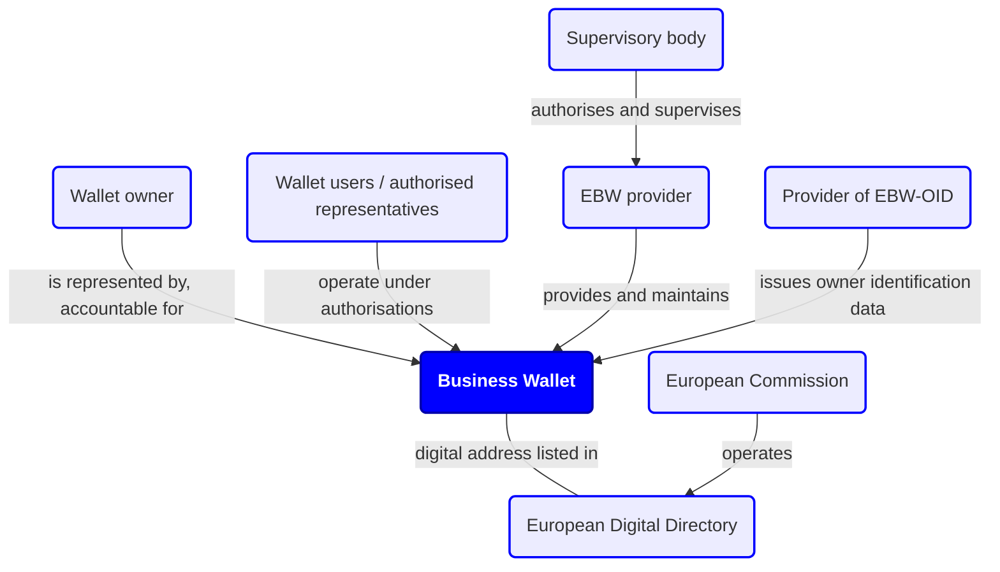
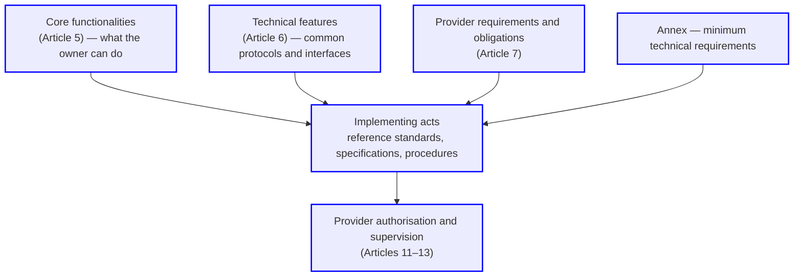

Revision 1.1

# Scope and context

This document sets out a non-technical working definition of "business wallet" as introduced in the European Business Wallet regulatory proposal, to support a common interpretation within WE BUILD and in dialogue with the European Commission. It is intended as reference material for the WE BUILD use case and capability work. It does not cover detailed architecture, protocol choices, implementation design, or use case roadmaps.

This document draws on the EUDI Wallet regulations, EWC deliverables [\[6\]](#references), and relevant industry and consortium publications. Its main legal reference is the text of the proposed Regulation on the establishment of European Business Wallets as agreed in the Council’s general approach of 9 June 2026, published as Council document 10346/26 [\[2\]](#references), read together with the original Commission proposal COM(2025) 838 [\[1\]](#references) and the European Parliament ITRE rapporteur’s draft report [\[3\]](#references).

# Purpose of the European Business Wallet

The European Business Wallet (EBW) is a digital tool for economic operators — companies, organisations, self-employed persons, sole traders and other entities conducting economic activity — to interact with public sector bodies when meeting reporting obligations and fulfilling administrative procedures, and to reuse the same trusted functions in business-to-business settings. Its purpose is to:

- reduce administrative burdens and compliance costs by replacing paper-based and fragmented digital processes;
- give economic operators and public sector bodies secure and trusted digital identification across borders;
- enable digital management of representation rights and authorisations; and
- provide a secure channel for exchanging official documents, attestations and legally valid notifications, supported by a common directory.

# Core concepts

## Description

A **Business Wallet** is a combination of software, hardware, services, settings and configurations that enables an organisation to identify itself, manage authorisations, exchange verified attributes and documents, and receive legally relevant notifications in support of administrative and regulatory procedures.

In the words of the draft Regulation, a European Business Wallet is a digital solution that allows its owner to **securely receive, store, manage, combine and present** owner identification data and electronic attestations of attributes to relying parties and to other entities using European Business Wallets or European Digital Identity Wallets (Article 3(1)). The European Parliament rapporteur proposes to make explicit that the wallet must also **securely request and obtain** such data, underlining that the wallet is an active participant in data exchange, not only a store (ITRE draft report). In practical terms, the wallet:

- authenticates its owner and provides verified owner identification data to relying parties;
- gives access to electronic attestations of attributes, electronic signatures and seals, electronic registered delivery and time stamps; and
- lets the owner create, manage, delegate and revoke authorisations for its users.

Unlike European Digital Identity Wallets, a European Business Wallet does not need to be an eID means under an eID scheme, although it may reuse similar components.

**_WE BUILD implementation note:_** _The topic of online business identity, potentially outside of eID schemes, needs to be further discussed within the WP4 Architecture group. It may also have consequences for the WP4 PID/LPID Providers group._

A full technical decomposition is out of scope for this document. For orientation, the draft Reguladdtion itself distinguishes the **wallet solution** (the combination of software, hardware, services and configurations offered by a provider), the **wallet unit** (a unique configuration of that solution provided to a specific owner), the **front-end** (the user-facing component) and the **back-end** (the server-side components). (Article 3(25)–(27), (42)–(43)).

## Wallet owner, users and representatives

Each Business Wallet has a single **wallet owner**, which is the entity that the wallet represents through its interactions. Note that this is distinct from, for example, the company owner or the wallet provider. An economic operator can become a wallet owner through ownership, licence, subscription or any other agreement granting a right of use (Recital 11).

The wallet owner is defined by **European Business Wallet Owner Identification Data (EBW-OID)**, which includes at least the official name of the owner as recorded in the relevant register, and an EU-unique identifier (Article 8(5)). These owner identification data are issued into the business wallet as an electronic attestation of attributes and must be **cryptographically bound** to the wallet of the owner (Article 6(2)(a)).

A Business Wallet can have multiple **wallet users**, meaning natural or legal persons that operate the wallet through a user interface or an application programming interface under roles and authorisations set by the wallet owner. These wallet users may apply software applications to access these interfaces. Some users may be **authorised representatives**, while others may be employees or service providers operating within delegated permissions.

On terminology: the Commission proposal used the term "mandate" for the permission granted by an owner to a representative. The Council text replaces this with **authorisation**, defined as the granting or recognition of a right or permission, given by the owner to a wallet user, to perform specified actions on specified resources or functionalities, together with the corresponding access-control decision for each concrete request (Article 3(19)). Two points follow:

1. Authorisations in the wallet are **technical**. They do not create, limit or otherwise affect any power of attorney or legal mandate under national or Union law (Article 5(1)(j), Recital 18).
2. The authorisation system should remain compatible with the EU digital power of attorney established by Directive (EU) 2025/25 (Recital 18).

## Relationship with the EUDI Wallet

The EBW builds on and complements the European Digital Identity Framework:

- The proposal amends Article 5a of the eIDAS Regulation so that the mandatory issuance of European Digital Identity Wallets applies to **natural persons only**. The EBW becomes the intended solution for legal persons and other economic operators.
- **EUDI Wallets, notified eID means and electronic attestations of attributes can be used to onboard the owner and to authenticate wallet users**. The natural person who enrols the owner (a legal representative or other lawfully empowered person) identifies with an eID means at level of assurance "high"/
- **Self-employed persons and sole traders** do not need to create a separate business identity: providers must offer the wallet's secure communication channel (QERDS) as a standalone service that these persons can use with their EUDI Wallet in a business capacity, at reasonable and affordable prices.
- The EP rapporteur adds, at recital level, that the use of EUDI Wallets should be **enabled but not required**, and that individual and business use should remain distinguishable. This is an architectural direction rather than an operative rule.

## Conceptual model

## Actors of EBW

## Key terminology

| Term | Meaning (simplified; see Article 3 for the legal definitions) |
|---|---|
| Wallet owner | The economic operator or public sector body that owns or has a right of use of the wallet and is accountable for its actions. (Article 3(7)) |
| Wallet user | A natural or legal person that uses the wallet (directly or via software). (Article 3(22)) |
| Authorised representative | A person acting on behalf of the owner on the basis of an authorisation granted by the owner. (Used descriptively in Articles 4, 7(6)(c) and 10(4)) |
| Authorisation | A technical right or permission, granted by the owner to a user, to perform specified actions on specified resources, plus the access-control decision that permits each concrete request. Replaces concept of mandate in the EUBW proposal. (Article 3(19)) |
| EBW-OID | Owner identification data: at least the official name and the unique identifier, issued as an electronic attestation of attributes. (Article 8(3))|
| Unique identifier | The European Unique Identifier (EUID) where the owner has one; otherwise a similar identifier created under the Regulation. (Article 9(1,2,3)) |
| Wallet solution / wallet unit | The provider's overall product / the specific configuration of it provided to one owner. (Article 3(25, 26)) |
| Wallet unit attestation | A data object that describes the components of a wallet unit and allows their authentication and validation. (Article 3(24)) |
| Relying party | A natural person, economic operator or public sector body that relies upon European Business Wallets. (Article 3(23)) |
| Provider of EBW-OID | A qualified trust service provider, a public sector body responsible for an authentic source, or the Commission (for Union entities). |
| Critical assets | Assets within or in relation to a wallet unit whose compromise would have a very serious, debilitating effect on the ability to rely on that unit (Article 3(27)). |

# Legal effect: the principle of equivalence

The Regulation establishes a **principle of equivalence** (Article 1(2), Article 4, Recitals 6 and 19):

> Where a wallet owner or authorised wallet user makes use of any of the qualified trust services forming part of core functionalities of a European Business Wallet referred to in Article 5(1), the resulting action has the same legal effect as if the action had been lawfully carried out in person, in paper form, or via any other means or processes compliant with applicable legal, administrative or procedural requirements.

The same applies where a self-employed person or sole trader uses the QERDS secure communication channel as a standalone service (Article 4, second paragraph).

The principle has clear limits:

- It applies only to actions resulting from the use of core functionalities that are **functionally equivalent** to their traditional counterparts and serve the same purpose — for example qualified electronic signatures, seals and attestations of attributes (Recital 6). Council general approach specifies that the principle related only to **qualified trust services forming part of core functionalities** of the wallet. (Article 4)
- **National procedural requirements still apply.** Additional safeguards or verifications that are part of an administrative procedure and are not supported by the wallet's core functionalities must still be fulfilled (Recital 6, Article 4, third paragraph).
- **Requirements on electronic formats remain applicable.** Where EU or national law requires an administrative step or a document in a particular electronic form, that requirement is observed (Article 4, third paragraph).
- At the same time, such requirements may not be applied in a way that excludes the use of the wallet's core functionalities **solely because of their digital nature** (Recital 6).

Related principles: information validly transmitted via an EBW should not have to be submitted again through physical or alternative digital means, and vice versa (Recital 51); the Regulation is without prejudice to the once-only right of legal persons and to existing systems for exchanges between competent authorities (Recital 10, Article 2(2)); and Member States should not add national requirements on matters within the Regulation's scope (Recital 51).

Note (EP position): the ITRE rapporteur proposes to tie the equivalence principle explicitly and only to core functionality **based on qualified trust services**. This narrows which parts of an EBW transaction benefit from the special equivalence rule; it does not mean that other actions have no legal or evidentiary effect under general law.

# Business Wallet definition

## Roles supported

A business wallet enables its owner, amongst other operations, to act as:

- Issuer, holder or verifier of electronic attestations of attributes
- Signatory or origin of sealed data
- Sender or recipient of messages, such as submissions and notifications

These operations are under role-based access control, where recognised roles comprise (as roles, not stated directly by Regulation):
- Wallet owner: the entity that is accountable for the legal consequences of the operation
- Authorised representative: a wallet user with an authorisation to act on behalf of the wallet owner, potentially with a limited scope or in limited contexts
In addition, the wallet owner may configure other roles that suit the owner's policies and/or national or EU law.
Other relevant roles are:
- Wallet provider: the entity that provides the business wallet solution to its owner (potentially the owner themselves); only providers included in the Commission's list of authorised providers may provide EBWs (Article 7(1))
- Owner identification data provider: the entity that verifies the identity of an authorised representative enrolling the wallet owner and attests, using an electronic attestation of attributes, the wallet owner's identification data in accordance with authentic source registrations
- Relying party: any party that relies on the wallet, for example a public sector body receiving a submission or a business partner verifying an attestation

## Types of requirements

The draft Regulation organises the requirements on Business Wallets in layers. Understanding these layers helps to read the rest of this document and to plan conformance work:

1. **Core functionalities (Article 5(1))** — the capabilities every EBW must give its owner. In simplified form: securely issue, request, obtain, select, combine, store, delete, share and present electronic attestations of attributes, with selective disclosure; securely exchange EBW-OID and attestations with other EBWs, EUDI Wallets and relying parties; sign with qualified electronic signatures and seal with qualified electronic seals; use qualified electronic time stamps; have attestations issued for data for which the owner is the primary source, and link attestations into verifiable chains; authenticate users with qualified and non-qualified attestations; transmit and receive documents and data via the QERDS set out in the Annex; authorise multiple users and manage and revoke those authorisations; authorise and manage relying-party requests; export and import wallet data; access a log of all communications and transactions; and access a common dashboard for the QERDS channel. Providers may offer additional functionalities as long as these do not compromise the core (Article 5(2)).
2. **Technical features (Article 6)** — the common protocols and interfaces the wallet must support: issuance of EBW-OID, attestations and certificates; relying-party request and validation; sharing and presentation with selective disclosure; interaction automatically without manual intervention or through direct user action; secure remote onboarding; wallet-to-wallet interaction (EBW–EBW and EBW–EUDIW); relying-party authentication; verification of wallet authenticity and validity; QERDS provision including the Directory interface and at least one unique digital address per owner; and wallet unit attestations. Accessibility for persons with disabilities is also mandated (2a,2e).
3. **Provider requirements and obligations (Article 7)** — who may provide wallets and under what conditions.
4. **Annex requirements** — minimum technical requirements grouped by topic: unit authentication (point 1), unit integrity (2), secure communication and critical asset management (3), secure cryptographic applications (4), unit authenticity and validity (5), revocation of unit attestations (6), transaction logs (7), qualified signatures and seals (8), signature creation applications (9), data export, import and portability (10), the secure legal communication channel (11), the access control mechanism (12), general protocols and interfaces (13), and issuance of attestations and EBW-OID to wallet units (14–17).
5. **Implementing acts** — the Commission will adopt lists of reference standards and, where necessary, specifications and procedures for the core functionalities, technical features, provider risk management, EBW-OID, unique identifiers and the Directory. In the Council text these acts are due within one year of entry into force (Articles 5(5), 6(5), 7(6c), 8(7), 9(4), 10(6), 11(2c)). The actual interoperability of the ecosystem will largely be decided in these acts.
6. **Authorisation and supervision (Articles 11–13)** — the process through which providers are admitted to and kept on the trusted list.

## Key functions

### Wallet lifecycle management

The business wallet enrols its owner via the electronic identification of an authorised (legal) representative — using an eID means at assurance level "high" (Article 6(1)(e)) — and facilitates enrolment in connected trust services and directory services. The wallet provider is responsible for attesting to its validity to relying parties (via wallet unit attestations and public validity information, Annex points 2, 5 and 6) and enabling authorised representatives to revoke the business wallet and perform other lifecycle changes.

The validity of a wallet must be revocable at least in the following circumstances (Article 6(2)(f)): upon explicit request of the owner; where the security of the wallet has been compromised; upon permanent or temporary cessation of the owner's activity; and where the provider is removed from the list of authorised providers. Users affected by the revocation of a wallet unit attestation must be informed within 24 hours (Annex point 6). Providers must also maintain termination plans that keep information accessible if they cease their activities (Article 11(2)(e)), and must notify owners of suspension, revocation or termination of the service and transfer or delete owner data according to the owner's instructions (Article 7(6)(f)).

**_WE BUILD implementation note:_** _This will be the responsibility of the WP4 Wallet Providers group. At least several providers will be ready to manage their wallet solution and issue wallet units under new and changing business wallet requirements._

### Owner identification data and unique identifiers

EBW-OID establishes the identity of the owner. Key points (Articles 8–9, Recitals 33–37):

- EBW-OID is issued in one of the standard formats of Implementing Regulation (EU) 2024/2979 as: a **qualified electronic attestation of attributes** (issued by a QTSP); an **attestation issued by or on behalf of a public sector body responsible for an authentic source**; or an **attestation issued by the Commission** (for Union entities). Commission-issued EBW-OID has the same legal effect as the other two forms.
- It contains at least the **official name** of the owner as recorded in the relevant register, and the **unique identifier**.
- Where the owner has been attributed a **European Unique Identifier (EUID)** under Directive (EU) 2017/1132 (publicly accessible through BRIS and used by BORIS), that identifier is used. Owners without an EUID receive a similar unique identifier created in accordance with a Commission implementing act, with measures ensuring that no owner has more than one identifier.
- Verification relies on **authentic sources** (business registers and other registers), which Member States notify to the Commission; the Commission publishes the list in machine-readable form.
- EBW-OID must be **cryptographically bound** to the owner's wallet (Article 6(2)(a)); the mechanisms supporting verification of its issuance, delivery and activation follow the assurance requirements referenced in Annex point 14.
- The Commission maintains an **attestation scheme** for EBW-OID in the EU catalogue of schemes (Article 8(6)).

### Digital document management

The business wallet enables the wallet owner to create, store, use and validate various types of digital documents:

- Electronic attestations of attributes (EAAs, including QEAA, PuB-EAA, and EAA issued by the Commission)
- Business documents, such as electronic invoices
- Qualified certificates for electronic signatures and seals
- Qualified electronic signatures, seals and timestamps
- Evidence, such as provided by trust service providers upon electronic transactions, or by public sector bodies over the single digital gateway

Additional points from the draft Regulation:

- **Selective disclosure**: the owner can disclose only the identification data and attributes needed for a given interaction (Article 5(1)(b)).
- **Owner-as-primary-source attestations**: attestations can be securely issued, by the provider on behalf of the owner, for data for which the owner itself is the primary source (Article 5(1)(f)). The legal issuer model for these attestations is still open.
- **Linked (chained) attestations**: an attestation can be cryptographically linked to others so that each attestation, and the chain as a whole, can be verified for authenticity and integrity. This supports submitting an attestation once and reusing a verifiable reference (for example a hash of a sealed attestation) across procedures (Article 5(1)(g), Recital 27). Currently the Regulation desribe chaining only for owner-primary-source attestations. (Article 5(1)(fg))
- **Typical business attributes** expected in the ecosystem include current address, VAT registration number, tax reference number, Legal Entity Identifier (LEI), EORI number and excise number (Recital 25).

**_WE BUILD implementation note:_** _The WP4 Wallet Providers provide, as part of their business wallet solutions, a subset of the functionalities required by the use cases. For the functionalities that require qualified trust services, such as the issuance of qualified certificates or the sealing of documents with qualified electronic seals, the WP4 QTSP group provides these services within WE BUILD. For reference, see the [QTSP documentation](#appendix-f-qtsp-documentation)._

### Secure communication channel

To enable public and private sector information exchange, such as in B2G eGovernment notifications, B2B/B2G eProcurement business documents and other business use cases, a business wallet implements a secure communication channel with other business wallets, with users of digital identity wallets, or with alternative solutions provided through a gateway. This channel enables cross-border delivery and receipt of submissions and notifications with legal effect, and provides a trusted channel with public authorities and other regulated parties across the EU.

The channel is implemented using a **qualified electronic registered delivery service (QERDS)** in accordance with Articles 43 and 44 of the eIDAS Regulation (Article 5(1)(i), Annex point 11). Key requirements from the Annex:

- The Commission will, by implementing act, **designate the protocol and set standards and specifications** for compliant implementations of the specific QERDS that serves as the mandatory secure legal communication channel. (The EP rapporteur proposes to allow **one or more** QERDS with redundancy and fallback; the Council text keeps a single designated channel with procedures for continuous availability, redundancy and fallback.)
- The designated QERDS must be based on **open, publicly available and royalty-free standards** and provide **end-to-end encryption**.
- Each owner is assigned **at least one unique digital address** (Article 6(1)(j)), registered in the **European Digital Directory** (see below).
- Owners access a **common dashboard** for storing and verifying QERDS communications (Article 5(1)(n)).

Two standalone service obligations widen access to the channel:

- Providers must offer the QERDS as a **standalone service to self-employed persons and sole traders** using their EUDI Wallets in a business capacity (Article 5(3), Recital 12).
- Providers must offer, as a standalone service, a **unique digital address to public sector bodies that do not own an EBW**, so those bodies can be listed in the Directory and reached over the channel (Article 6(1a)).

**_WE BUILD implementation note:_** _the WP4 QTSP group will explore delivering an interoperable pre-production QERDS, along with CIR (EU) 2025/1944 requirements, as a service to the WP4 Wallet Providers group, working with the WP4 Architecture group on cross-cutting concerns, such as interoperability specifications. This enables wallet providers to provide a business wallet to the use cases with a digital address and access to the designated QERDS. For reference, see the [QERDS documentation](#qerds-documentation)._

### European Digital Directory

The Commission establishes, operates and maintains a **European Digital Directory** as the trusted source of information for EBW owners (Article 10, Recital 38). It takes the form of a web application with two interfaces: a machine-readable API for system-to-system communication, and a secure web portal for authenticated and authorised wallet users.

For each owner, providers submit at least: the official name (as in the national register of the country of establishment or habitual residence), the unique identifier, the digital address(es), and the country of establishment. Public sector bodies that are not EBW owners are also listed, with the same categories of information. Keeping the Directory accurate is a chain of duties: providers verify owner information at least **every 72 hours** (where applicable using mechanisms of the relevant authentic sources), and communicate changes to the Commission within **one working day** of receipt. These arrangements should not indirectly create a requirement for economic operators to update the information. Access to the Directory is limited to wallet owners, wallet users, providers and Member State authorities. The Directory relies on information made available by business registers (including through BRIS) without duplicating it, and must comply with data-protection principles such as data minimisation (Recitals 38–39).

### Access control mechanism

To enable wallet owners, authorised representatives and other authorised users to access the business wallet while preventing unauthorised access, each business wallet implements role-based access control for the assets it protects, including digital documents and the secure communication channel. To identify, authenticate, and authorise wallet users, the access control mechanism relies on electronic identification means, such as digital identity wallets, and, potentially, on trust services for the electronic attestation of attributes. Access to a wallet unit is granted only after successful authentication with a notified eID means at assurance level "substantial" at least, or an alternative mechanism recognised as equivalent (Annex point 1).

The Annex (point 12) and Article 6(2)(b) make the authorisation model concrete. Authorisation decisions are based on one or more of: the attestations of the acting subject; the subject's formal role within a recognised organisational structure; the scope, validity and constraints of any mandate, delegation or power of attorney; and contextual policies at Union or national level. Providers must ensure that:

- authorisation outcomes are **fine-grained and auditable**: visibility of credentials is selective and conditioned on access rights; access to business processes and submission interfaces is controlled by real-time validation of roles and mandates; and all access and execution events are logged, timestamped and bound to cryptographically verifiable proofs of authorisation suitable for audit and legal proceedings;
- **mappings between roles and attributes** are verifiable, auditable, revocable and traceable to their legitimate issuers;
- **conflicts of roles, over-delegation and expired authorisations** are automatically detected and prevented in real time; and
- **all authorisation logic is interoperable** between European Business Wallets across Member States.

The formats for roles and attributes, interoperability mechanisms for mandates and delegations across wallets, protocols and policy language, and logging requirements will be defined in implementing acts; the exchange of data on authorisations with national registers is named as an example of what these acts will cover (Article 6(5), Annex point 12(4)).

**_WE BUILD implementation note:_** _The WP4 Architecture group, in collaboration with the WP4 Wallet Providers group, will explore the access-control mechanism for business-wallet solutions. This may rely on the EUDI wallets within WE BUILD or on other electronic identification means._

### Digital transaction management

Business wallets keep logs and provide dashboard user interfaces to enable control over transactions, including operations on the wallet lifecycle and on digital documents and messages sent and received over the secure communication channel. In addition, these logs enable dispute resolution regarding potentially unauthorised transactions, failures to meet reporting obligations, or administrative or procedural activities.

The Annex (point 7) specifies the minimum logging policy: electronic signing, sealing and notifications of all transactions with relying parties, other EBW units and EUDI Wallet units are logged whether or not the transaction completes. Each entry contains at least the time and date; the name, contact details and unique identifier of the relying party (or wallet unit attestation information for other wallets); the types of data requested and presented; and, for non-completed transactions, the reason. Providers must ensure the integrity, authenticity, availability and confidentiality of the logs, which remain accessible as long as required by Union or national law.

### Data export, import and portability

The wallet owner can **export** its data — including issued EBW-OID, electronic attestations of attributes, communication logs and transaction records — in a structured, commonly used and machine-readable format, on request (European Council explicitly requested removal of this feature) or when the service terminates or the provider loses its authorisation (Article 5(1)(l)). The owner can also **import** such data to another provider's wallet, enabling portability across providers (Article 5(1)(la)).

Portability of data does not by itself settle the continuity of cryptographic keys, provider-bound attestations, wallet unit attestations, authorisation structures or directory and delivery addresses across a migration; these remain design questions.

# Ecosystem and governance

## Wallet providers and supervision

Only providers included in the Commission's public, machine-readable **list of authorised providers** may provide European Business Wallets (Articles 7(1), 12(3)). The main conditions and obligations (Articles 7 and 11):

- **Establishment and control**: providers must be established in the Union, have their principal place of business and main operations in the Union, and must not present a risk to the security of the Union; in particular they must not be subject to control by a third country or third-country entity. The Commission will adopt an implementing act on the tools, indicators and assessment frameworks for this security-risk determination (Article 7(2), (2a)).
- **Trust and cybersecurity baseline**: providers must comply with the trust-service-provider requirements of Article 19a of the eIDAS Regulation (unless they are already QTSPs), the requirements for essential entities under the NIS2 Directive (EU) 2022/2555, and applicable cybersecurity rules including those on high-risk suppliers, extending to their software and security suppliers.
- **Risk management**: providers must maintain policies and measures against legal, business, operational and other direct or indirect risks, covering at least registration and onboarding procedures, the procedural and administrative checks needed to provide wallets, and the management and implementation of the wallets (Article 7(6)(aa)); keep a documented, up-to-date risk assessment; and update their self-assessment at least every 24 months or immediately after significant incidents, substantial changes, suspensions of security-relevant functions, or newly identified risks (Article 7(6a)–(6b)).
- **Authorisation process**: entities apply to the national supervisory body with identification information, a description of how the core functionalities will be offered, and a self-assessment report demonstrating conformity with Articles 5, 6, 7 and the Annex, including a risk assessment and termination plans. Assessments and certifications already produced under other Union law (for example under the eIDAS Regulation or the Cyber Resilience Act) can be reused where they cover corresponding requirements but the two routes differ: risk assessments carried out under any applicable Union law may be reused (Article 11(2a)), whereas the reuse of conformity assessment reports and certificates is confined to those issued under Regulation (EU) No 910/2014 (Article 11(2b)). The Cyber Resilience Act (Regulation (EU) 2024/2847) is mentioned only in Recital 30, not in an operative provision. The supervisory body has 60 days to review an application, may set a deadline of up to 15 calendar days for additional information and, where it exceeds the 60-day period, a further period of up to 20 calendar days; listing follows within two working days (Articles 11(4)–(6), 12(3)).  Applicants have a right to an effective judicial remedy (Article 11(7)).
- **QTSP light route**: qualified trust service providers are not subject to the full review; upon submission of the required information they are added to the list and may immediately offer wallets (Article 11(3)). (The EP rapporteur proposes removing this dedicated route.)
- **Supervision and penalties** (in brief): each Member State designates a supervisory body with ex-post supervisory powers; administrative fines can reach up to 2% of total worldwide annual turnover; in cases of persistent non-compliance the Commission can temporarily suspend a provider from the list; the Commission itself supervises Union entities other than Union institutions that act as providers (Articles 13 and 15).
- **Open source encouragement**: providers are encouraged to release the source code of the wallet application software under an open source licence (Recital 28).
The European Digital Identity Cooperation Group coordinates national practices and policies for the Regulation (Article 14).

## Third-country aspects

- The Commission may adopt implementing acts recognising **third-country business wallets, solutions or frameworks** as offering equivalent assurances, provided they are interoperable with the eIDAS trust framework and support at least identification, authentication and the exchange of electronic attestations of attributes. The prior assessment covers data-protection standards, cybersecurity compliance and independence from control by high-risk governments (Article 17).
- Providers may issue EBWs to **economic operators established outside the Union**, provided identity proofing meets the methods of Article 24(1a) of the eIDAS Regulation and the operator holds only one set of EBW-OID and one unique identifier; supervisory bodies cooperate (and may use the Directory) to prevent duplicates (Article 18).

# Obligations on public sector bodies and timelines

Public sector bodies — including Union entities — must enable economic operators to use the wallet's core functionalities to **identify and authenticate, sign or seal, submit documents, and send or receive notifications**, for the purpose of meeting a reporting obligation or fulfilling an administrative procedure (Article 16(1)). For submissions and notifications they must themselves have EBWs including the QERDS channel (Article 16(2)), subject to the transition arrangement described in the Secure communication channel section of this document. Public sector bodies keep flexibility on *how* they accept the wallets, may maintain existing interfaces and digital tools, and should avoid disproportionate burdens especially on SMEs (Recital 7). (The EP rapporteur additionally proposes exempting municipalities with 10,000 inhabitants or fewer from the mandatory acceptance obligation.)

Indicative timelines under the Council text (Article 22) — all subject to the final adopted text:

1. Provisions empowering implementing acts and governance apply from **entry into force**; the Commission adopts the main implementing acts within **one year** of entry into force.
2. The Regulation generally applies from the **date of application of the last of those implementing acts**.
3. Public-sector acceptance obligations (Article 16) apply **two years after** that date, with the QERDS transition derogation running until then.
This "anchor the deadlines to the implementing acts" model, also proposed by the EP rapporteur, reduces the risk that acceptance obligations start before the technical specifications exist.

# Current challenges and open topics

The following topics are known to be unsettled. For each, this section summarises what the draft texts already say and what remains open.

## Automated machine-to-machine communication and agent-mediated transactions

**What is known.** The Regulation requires protocols and interfaces that allow interaction with the wallet "automatically without manual intervention or through direct wallet user action" (Article 6(1)(d)), and API access is part of the wallet concept. Recital 28 names the integration of new technologies enabling new use cases, "such as agentic AI or the provision of a digital identity to an owner's asset", as material for future implementing acts. The ITRE draft report goes further: it defines an "automated transaction", requires that automated actions take place under a valid, auditable and revocable authorisation, and requires assurance and accountability equivalent to a direct user action. WE BUILD has published a non-paper arguing that the EUDI and Business Wallet frameworks can provide the trust infrastructure for AI agents (mutual authentication of agents, verifiable human–agent relationships, verified merchants) [\[7\]](#references).

**What is open.** The identity or technical identity of the agent; the credential or delegation object that expresses the scope, duration and revocability of its authority; the policy language; the audit evidence; and liability when an agent acts outside its authority. None of these is specified in the legal texts; they are architecture and implementing-act questions.

**_WE BUILD implementation note:_** _per the ITRE briefing, this topic should cover agent identity, delegated authority, revocation, audit evidence, assurance equivalence and accountability — not only an M2M transport protocol._

## Business identity outside eID schemes and mutual identification of wallets

**What is known.** An EBW does not need to be an eID means. Identification and authentication in the framework rely on electronic attestations issued by trusted entities (Recital 16). Wallets must interact with other EBWs and with EUDI Wallets, authenticate relying parties where required, and prove their own authenticity and validity via wallet unit attestations and validation mechanisms (Article 6(1)(f)–(h), Annex points 2, 5 and 13). The EP rapporteur describes the interaction as multidirectional and adds validation.

**What is open.** The relying-party authentication mechanism; whether EUDI Wallet relying-party access certificates are reused unchanged; the precise relationship between EBW-OID (owner), the wallet unit attestation (wallet unit) and the credentials of the acting representative (user); and the consent and disclosure-policy handshake between wallets.

**_WE BUILD implementation note:_** _EBW-OID, wallet unit attestation, representative identity, relying-party authentication and consent should be kept as distinct design elements in the WE BUILD conformance and architecture work._

## Authorisation interoperability and the legal/technical boundary

**What is known.** Authorisation logic must be interoperable across Member States, mappings must be verifiable, auditable, revocable and traceable, and conflicts must be prevented in real time (Article 6(2)(b), Annex point 12). Authorisations are technical and do not affect legal powers of attorney (Article 5(1)(j)); compatibility with the EU digital power of attorney is expected (Recital 18). The exchange of authorisation data with national registers is named as an implementing-act topic (Article 6(5)).

**What is open.** There is no common authorisation or mandate credential yet, no agreed policy language, and no established mapping between technical wallet permissions and legal representation under national law. That mapping will differ per Member State and per procedure.

## Owner-issued ("primary source") attestations

**What is known.** Attestations can be issued, by the provider on behalf of the owner, for data for which the owner is the primary source, and linked into verifiable chains (Article 5(1)(f)–(g), Recital 27).

**What is open.** Whether the owner, the provider or a separate attestation provider is the legal issuer; who appears in the issuer field; whether the attestation asserts only that the owner declared the data or that it was verified; which assurance, status and revocation rules apply; and whether this issuance is a trust service.

## Assurance levels per lifecycle stage

**What is known.** Wallet unit access requires authentication at level of assurance "substantial" at least (Annex point 1). Remote onboarding uses a legal representative's eID means at "high" (Article 6(1)(e)). Verification of EBW-OID issuance, delivery and activation is anchored to the assurance requirements of Implementing Regulation (EU) 2015/1502, with the Council text marking a move towards "high" for that verification (Annex point 14(2)(c)). The EP rapporteur raises specified identity-lifecycle processes to "high" while leaving ordinary authentication at "substantial".

**What is open.** The final level per process, and the conformity model: the Council text relies on self-assessment and ex-post supervision rather than a certification scheme like the one being prepared for EUDI Wallets. Conformance work should therefore test assurance **per lifecycle stage** (user authentication, onboarding, EBW-OID issuance/delivery/activation, critical cryptographic operations, migration) rather than assign one level to the whole wallet.

## QERDS designation, multiplicity and resilience

**What is known.** The Council text has the Commission designate the protocol and the standards for compliant implementations of "the specific" QERDS serving as the mandatory channel, with requirements on open royalty-free standards, end-to-end encryption, and procedures for continuous availability, redundancy and fallback (Annex point 11). The EP rapporteur allows one or more QERDS.

**What is open.** Whether multiple designated services will coexist; provider selection; routing and address resolution; portability between QERDS providers; and whether every wallet must be preconfigured with more than one service. For Member States with an established national delivery channel that is not a QERDS, the coexistence of that channel with a designated EU-level QERDS is a further open question, which the deletion of Article 16(3) moves into the implementing acts rather than resolving.

## Portability continuity

**What is known.** Export and import of owner data in an open, machine-readable format are required core functionalities (Article 5(1)(l)–(la), Annex point 10).

**What is open.** Continuity across providers of cryptographic keys, provider-issued or provider-bound attestations, wallet unit attestations and status services, authorisation structures, and directory and delivery addresses. These are migration and provider-exit design questions.

## Sovereignty and hosting

**What is known.** Providers must be EU-established with main operations in the EU and free of third-country control; high-risk-supplier restrictions can apply (Article 7(2), 7(5), Recitals 31–32).

**What is open (EP proposals).** The ITRE draft report extends the sovereignty conditions to "supporting infrastructure service providers" (cloud hosting, cryptographic key management, secure networks, identity-verification tools) and requires EBW data to be stored and processed exclusively in the Union. If retained, this would materially affect supplier eligibility, cloud architecture, key management and disaster recovery. The exact scope of "European Business Wallet data" (telemetry, support access, backups) is undefined.

## Separation of personal and professional identity: the "Employee Wallet" idea

**What is known.** The Regulation expects the natural persons acting for an owner — representatives and employees — to authenticate to the wallet with electronic identification means, such as EUDI Wallets (Annex point 1, Recital 25). In practice, this raises a concern: employees may not want to use their **personal** EUDI Wallet, typically installed on a private device, for **professional** actions, and many organisations prohibit the use of private devices or private identity means for business transactions. The EP rapporteur's recital-level position that individual and business use should remain distinguishable points in the same direction.

**Current ideas.** One market response is a companion mobile application for employees — often called an **"Employee Wallet"** — that works together with the (typically web-based) Business Wallet of the organisation. The idea: the organisation issues professional credentials (for example a verified-employee attestation with name, employee ID and department) from its Business Wallet into the employee's companion wallet; the employee then uses these professional credentials to authenticate to the EBW and to act in their professional role, while their personal EUDI Wallet and personal credentials stay separate. This separates professional life from private life and keeps the employment relationship, not the private identity, at the centre of business transactions. Such solutions already exist in the market: at least one WE BUILD participant offers an organisational Business Wallet that issues and verifies credentials such as employee IDs, together with a companion wallet for individuals that manages personal and professional credentials in one secure app while keeping them distinguishable [\[8\]](#references). The broader rationale for separating "private individual" and "employee" credential contexts is also discussed in the wider identity community [\[9\]](#references).

**What is open.** The Employee Wallet is a market concept, not something defined in the draft Regulation. Open questions include: who issues and revokes employee credentials and how their lifecycle follows the employment relationship (for example revocation when employment ends); which assurance level such an app can reach and whether it qualifies as "an alternative authentication mechanism recognised as equivalent" to a notified eID means at level "substantial" under Annex point 1; how it relates to the wallet's role and authorisation model; and device policy (private versus corporate devices).

## Uniformity of public-sector acceptance

**What is known.** All public sector bodies must enable the four acceptance actions (identify/authenticate, sign/seal, submit, notify), with flexibility on implementation (Article 16, Recital 7).

**What is open.** The EP rapporteur proposes exempting municipalities with 10,000 inhabitants or fewer from the mandatory obligation. If retained, B2G coverage would be less uniform than the Commission proposal suggested, which matters for pilot and rollout planning.

# References

1. European Commission, Proposal for a Regulation on the establishment of European Business Wallets, COM(2025) 838, 19 November 2025 — [EUR-Lex](https://eur-lex.europa.eu/legal-content/EN/TXT/?uri=celex:52025PC0838); accompanying Staff Working Document [SWD(2025) 837](https://eur-lex.europa.eu/legal-content/EN/TXT/?uri=celex:52025SC0837).
2. Council of the European Union, General approach on the proposal, doc [10346/26, 10 June 2026](https://data.consilium.europa.eu/doc/document/ST-10346-2026-INIT/en/pdf); [press release, 9 June 2026](https://www.consilium.europa.eu/en/press/press-releases/2026/06/09/european-business-wallets-council-adopts-negotiating-position/).
3. European Parliament, ITRE rapporteur's draft report [PE785.244](https://www.europarl.europa.eu/doceo/document/ITRE-PR-785244_EN.pdf), 20 March 2026; see also the WE BUILD briefing `itre-draft-report-ebw-briefing.md`.
4. European Parliament, procedure file [2025/0358(COD)](https://oeil.europarl.europa.eu/oeil/en/procedure-file?reference=2025%2F0358%28COD%29) and [Legislative Train entry](https://www.europarl.europa.eu/legislative-train/carriage/european-business-wallet/report?sid=10001).
5. European Economic and Social Committee, opinion INT/1110 on the proposal, adopted 18 March 2026 — [EESC page](https://www.eesc.europa.eu/en/our-work/opinions-information-reports/opinions/european-business-wallet).
6. EU Digital Identity Wallet large-scale pilots — [EWC pilot overview](https://ec.europa.eu/digital-building-blocks/sites/spaces/EUDIGITALIDENTITYWALLET/pages/920064565/LSP-EWC) and [WE BUILD Consortium](https://www.webuildconsortium.eu/).
7. Biometric Update, [EU can rein in AI agents with EUDI Wallets and business wallets: WE BUILD](https://www.biometricupdate.com/202603/eu-can-rein-in-ai-agents-with-eudi-wallets-and-business-wallets-we-build), March 2026 (on the WE BUILD non-paper).
8. Credenco — [company site](https://www.credenco.com/?lang=en), [Business Wallet documentation](https://docs.acc.credenco.com/), and [monthly update, January 2026](https://www.credenco.com/post/monthly-update-and-looking-ahead?lang=en) (companion wallet for personal and professional credentials; WE BUILD Business Wallet workshop and Integration Test Bed participation).
9. Spherity, [Verifiable Credentials in 'Private Individual' vs 'Employee' contexts (x2i vs x2e)](https://medium.com/spherity/verifiable-credentials-in-private-individual-vs-employee-contexts-x2i-vs-x2e-5b8ac36f5b9f); FIDES community, [Organizational and business wallets explained](https://fides.community/topics/business-wallets/).
