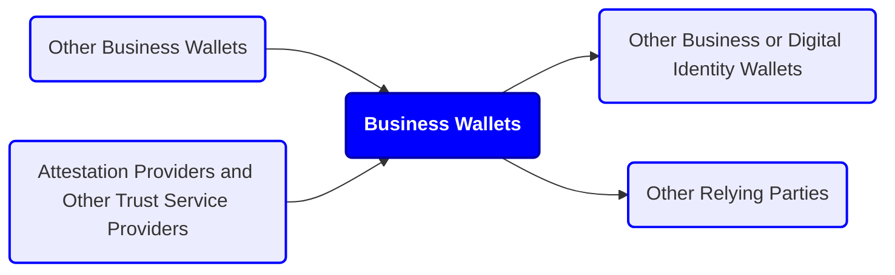
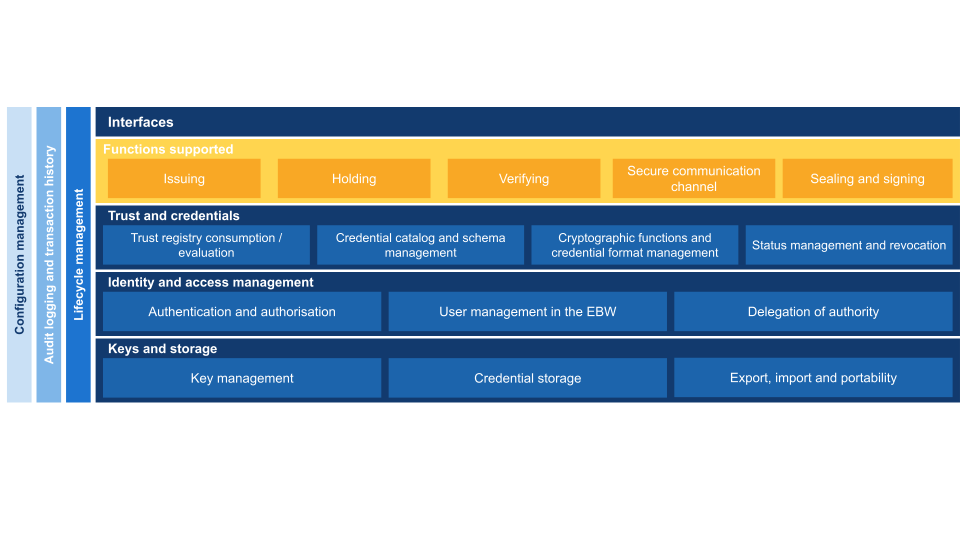

Revision 1.0

# Scope and context

This document sets out a non-technical working definition of “business wallet” as introduced in the European Business Wallet regulatory proposal, to support a common interpretation within WE BUILD and in dialogue with the European Commission. It is intended as reference material for the WE BUILD use case and capability work. It does not cover detailed architecture, protocol choices, implementation design, or use case roadmaps.

This document draws on the EUDI Wallet regulations, EWC deliverables[\[1\]](#footnote-0), and relevant industry and consortium publications, and incorporates the draft Implementing Act on Business Wallet.

# Core concepts

## Description

A **Business Wallet** is a product and service that enables an organisation to identify itself, manage authorisations, exchange verified attributes and documents, and receive legally relevant notifications in support of administrative and regulatory procedures. Unlike European Digital Identity Wallets, an European Business Wallet does not need to be an eID means under an eID scheme, although it may reuse similar components.

**_WE BUILD implementation note:_** _The topic of online business identity, potentially outside of eID schemes, needs to be further discussed within the WP4 Architecture group. It may also have consequences for the WP4 PID/LPID Providers group._

A technical decomposition (front end, back end, and cryptographic components) is out of scope for this document.

Each Business Wallet has a single **wallet owner**, which is the entity that the wallet represents through its interactions. Note that this is distinct from, for example, the company owner or the wallet provider.

The wallet owner is defined by **European Business Wallet Owner Identification Data (EBW-OID)**, which includes an official name and an EU-unique identifier. These owner identification data are issued into the business wallet as an electronic attestation of attributes.

A Business Wallet can have multiple **wallet users**, meaning natural or legal persons that operate the wallet through a user interface or an application programming interface under roles and mandates set by the wallet owner. These wallet users may apply software applications to access these interfaces. Some users may be **authorised representatives**, while others may be employees or service providers operating within delegated permissions.

## Conceptual model

# Business Wallet definition

## Roles supported

A business wallet enables its owner, amongst other operations, to act as:

- Issuer, holder or verifier of electronic attestations of attributes
- Signatory or origin of sealed data
- Sender or recipient of messages, such as submissions and notifications

These operations are under role-based access control, where recognised roles comprise:

- Wallet owner: the entity that is accountable for the legal consequences of the operation
- Authorised representative: a wallet user with an administrative mandate to act on behalf of the wallet owner, potentially with a limited scope or in limited contexts

In addition, the wallet owner may configure other roles that suit the owner’s policies and/or national or EU law.

Other relevant roles are:

- Wallet provider: the entity that provides the business wallet solution to its owner (potentially the owner themselves)
- Owner identification data provider: the entity that verifies the identity of an authorised representative enrolling the wallet owner and attests, using an electronic attestation of attributes, the wallet owner's identification data in accordance with authentic source registrations

## Architecture overview

*Figure D.1: architecture overview of the European Business Wallet.*

The figure groups the capabilities of a business wallet in five layers, from the interfaces it exposes to the keys and storage at its core, with three concerns that apply across all of them. The business wallet is a set of standardised identity, trust and authorisation services, and an entry point into a broader trust infrastructure rather than that infrastructure itself. Transactional business data and operational workflows stay in the systems that already hold them. Several of these capabilities are described in more detail under Key functions below.

**Related decisions:** [Architectural scoping of the European Business Wallet](https://github.com/webuild-consortium/wp4-architecture/pull/200).

### Interfaces

The wallet exposes its capabilities to the people who operate it and to the systems of the wallet owner. Interaction is user-driven or automated without manual intervention, which is what makes the wallet usable between systems. Counterparties, endpoints and digital addresses can be found through the European Digital Directory.

**Related decisions:** [Baseline protocols](https://github.com/webuild-consortium/wp4-architecture/blob/main/adr/base-protocols.md), [EBW EAA Exchange Automation](https://github.com/webuild-consortium/wp4-architecture/blob/main/adr/EBW-EAA-exchange-automation.md), [Structure the European Digital Directory as identification, discovery, and connection](https://github.com/webuild-consortium/wp4-architecture/blob/main/adr/build-edd-identification-discovery-connection.md), [EAA Extension for the EDD](https://github.com/webuild-consortium/wp4-architecture/blob/main/adr/EAA-extension-for-the-EDD.md), [Credential Offer Endpoint Registry and Lookup Service](https://github.com/webuild-consortium/wp4-architecture/blob/main/adr/ebw-endpoint-lookup-service.md).

### Functions supported

These are the operations the owner performs through the wallet, matching the roles set out above. Issuing, holding and verifying concern electronic attestations of attributes. The secure communication channel carries submissions and notifications. Sealing and signing give legal effect. Attestations and data transfer are deliberately kept apart.

- **Issuing.** Attestations are issued into other wallets, and can be linked to other attestations so that a chain can be verified as a whole. Self-issued attributes are permitted but do not carry the assurance of a qualified attestation. No authorisation is needed to attest a particular attribute, but an attestation scheme may restrict who may issue a given type. Self-issued and provider-issued attestations of the same attribute are different schemes, because their issuance and revocation procedures differ.
- **Holding.** Receiving, storing, selecting, combining and presenting attestations, with selective disclosure so that only the attributes needed for an interaction are shared.
- **Verifying.** Requesting and validating attestations and owner identification data. A relying party holding a valid access certificate can make a request; the owner's policy governs what is released, and the automatic approval list governs what is released without a person approving each exchange. Authorising relying parties is separate from authorising the wallet's own users.
- **Secure communication channel.** Submissions and notifications are transmitted and received over a qualified electronic registered delivery service, which supplies the evidence of sending and receipt. That delivery evidence is sealed; the documents and notifications themselves need not be. The channel is described under Key functions.
- **Sealing and signing.** Qualified signatures and seals are created with qualified certificates and a qualified creation device that is local, external or remote to the wallet; both are qualified trust services. Qualified time stamps bind data to a point in time. The signature creation application may come from the wallet provider, a trust service provider or a relying party.

**Related decisions:** [Separate attestations, documents, and data in EBW](https://github.com/webuild-consortium/wp4-architecture/blob/main/adr/build-document-vs-attestation.md), [QEAA Attestations and QERDS Documents](https://github.com/webuild-consortium/wp4-architecture/blob/main/adr/adr-qeaa-attestations-qerds-documents.md), [Acceptance of Self-Issued Attributes](https://github.com/webuild-consortium/wp4-architecture/blob/main/adr/Acceptance-of-Self-Issued-Attributes.md), [Deliver business wallet data using QERDS](https://github.com/webuild-consortium/wp4-architecture/blob/main/adr/build-qerds.md), [Separate QERDS registry from relay](https://github.com/webuild-consortium/wp4-architecture/blob/main/adr/qerds-registry-relay.md), and the type vocabulary and decision tree proposed in [PR 288](https://github.com/webuild-consortium/wp4-architecture/pull/288).

### Trust and credentials

This layer is what the functions rely on. Trust registry consumption and evaluation means resolving trust anchors from published trusted lists and evaluating counterparties against them; the wallet consumes those lists rather than operating them. What a counterparty is entitled to do is established separately, through registration data and relying-party access certificates. Credential catalog and schema management covers the attestation schemes and rulebooks a wallet supports, which determine how an attestation is structured and interpreted. Cryptographic functions and credential format management covers the formats and cryptographic profiles it supports. Status management and revocation let a relying party check whether an attestation is still valid, using the IETF Token Status List.

**Related decisions:** [Publish consortium trusted lists](https://github.com/webuild-consortium/wp4-architecture/blob/main/adr/trusted-lists.md), [Specify PID and eAA formats](https://github.com/webuild-consortium/wp4-architecture/blob/main/adr/document-formats.md), [Attestation Revocation Mechanism](https://github.com/webuild-consortium/wp4-architecture/blob/main/adr/attestation-revocation-mechanism.md), and the conformance specification for wallet-relying party access and registration certificates proposed in [PR 287](https://github.com/webuild-consortium/wp4-architecture/pull/287).

### Identity and access management

The owner is identified by European Business Wallet Owner Identification Data, a stable minimal attribute set cryptographically bound to the wallet. Users authenticate with an electronic identification means before any wallet functionality becomes available. Authorisations granted inside the wallet, whether technical or administrative, do not create, limit or affect any power of attorney or legal mandate. Delegation of authority supports both role-based and service-based models.

**Related decisions:** [Provide EBWOID as a stable minimal basis](https://github.com/webuild-consortium/wp4-architecture/blob/main/adr/basic-lpid.md), [Replace LPID with EBWOID](https://github.com/webuild-consortium/wp4-architecture/blob/main/adr/001-replace-lpid-with-ebwoid.md), [Role-Based vs Service-Based Authorization](https://github.com/webuild-consortium/wp4-architecture/blob/main/adr/Role-Based-vs-Service-Based-Authorization.md), [Atomic Granularity for Mandate-Related Attestations](https://github.com/webuild-consortium/wp4-architecture/blob/main/adr/Atomic-Granularity-for-Mandate-Related-Attestations.md), [Support for Sole Trader Representation](https://github.com/webuild-consortium/wp4-architecture/blob/main/adr/Support-for-Sole-Trader-Representation.md), and the minimum viable taxonomy for PoA and PoR proposed in [PR 224](https://github.com/webuild-consortium/wp4-architecture/pull/224).

### Keys and storage

Keys are generated, protected and used inside a wallet secure cryptographic application and device. Attestations and documents are stored for the owner, and export and import make that data portable between wallet providers.

### Cross-cutting concerns

**Configuration management** holds the policies the owner sets and controls, including the automatic approval list. **Audit logging and transaction history** records transactions with relying parties and other wallets, whether or not they complete, so the owner keeps control and disputes can be resolved. **Lifecycle management** covers enrolment of the owner, the business wallet unit attestation that lets others check the wallet's authenticity and validity, and suspension, revocation and termination.

**Related decisions:** [Wallet Unit Attestation and Lifecycle Management](https://github.com/webuild-consortium/wp4-architecture/blob/main/adr/wallet-unit-lifecycle-management.md), [Business Wallet Unit Attestation based on TS3](https://github.com/webuild-consortium/wp4-architecture/blob/main/adr/bwua-ts3-attestation.md).

**_WE BUILD implementation note:_** _Not every capability in this overview is covered by a decision record yet. No ADR has been recorded for sealing and signing, for attestation schemes and rulebooks, or for key management, storage and portability; auditing and logging is open in [issue 243](https://github.com/webuild-consortium/wp4-architecture/issues/243) and authorisation per attestation scheme in [issue 102](https://github.com/webuild-consortium/wp4-architecture/issues/102). Two trust anchors are under discussion: how the identity of an EAA provider is verified, by attestation chaining or by a qualified certificate anchored in the trusted lists, proposed in [PR 168](https://github.com/webuild-consortium/wp4-architecture/pull/168); and how a business wallet acting as a relying party identifies itself to another wallet, discussed in [issue 250](https://github.com/webuild-consortium/wp4-architecture/issues/250) and proposed in [PR 205](https://github.com/webuild-consortium/wp4-architecture/pull/205), with alternatives in [PR 286](https://github.com/webuild-consortium/wp4-architecture/pull/286) and [PR 287](https://github.com/webuild-consortium/wp4-architecture/pull/287). The scope of the issuing function for attestations about data for which the owner is the primary source depends on the outcome of the legislative process._

## Key functions

### Wallet lifecycle management

The business wallet enrols its owner via the electronic identification of an authorised representative and facilitates enrolment in connected trust services and directory services. The wallet provider is responsible for attesting to its validity to relying parties and enabling authorised representatives to revoke the business wallet and perform other lifecycle changes. In several cases, the wallet provider is also responsible for notifying authorised representatives and government authorities about lifecycle changes.

**_WE BUILD implementation note:_** _This will be the responsibility of the WP4 Wallet Providers group. At least several providers will be ready to manage their wallet solution and issue wallet units under new and changing business wallet requirements._

### Digital document management

The business wallet enables the wallet owner to create, store, use and validate various types of digital documents:

- Electronic attestations of attributes (EAAs, including QEAA, PuB-EAA, and EAA issued by the Commission)
- Business documents, such as electronic invoices
- Qualified certificates for electronic signatures and seals
- Qualified electronic signatures, seals and timestamps
- Evidence, such as provided by trust service providers upon electronic transactions, or by public sector bodies over the single digital gateway

For this purpose, the business wallet implements several applications, including signature creation and secure cryptographic applications.

**_WE BUILD implementation note:_** _The WP4 Wallet Providers provide, as part of their business wallet solutions, a subset of the functionalities required by the use cases. For the functionalities that require qualified trust services, such as the issuance of qualified certificates or the sealing of documents with qualified electronic seals, the WP4 QTSP group provides these services within WE BUILD. For reference, see the [QTSP documentation](#appendix-f-qtsp-documentation)._

### Secure communication channel

To enable public and private sector information exchange, such as in B2G eGovernment notifications, B2B/B2G eProcurement business documents and other business use cases, a business wallet implements a secure communication channel with other business wallets, with users of digital identity wallets, or with alternative solutions provided through a gateway. This channel enables cross-border delivery and receipt of submissions and notifications with legal effect, and provides a trusted channel with public authorities and other regulated parties across the EU. The channel is implemented using a qualified electronic registered delivery service (QERDS). The digital address for the channel is registered in a standard digital directory.

**_WE BUILD implementation note:_** _the WP4 QTSP group will explore delivering an interoperable pre-production QERDS, along with CIR (EU) 2025/1944 requirements, as a service to the WP4 Wallet Providers group, working with the WP4 Architecture group on cross-cutting concerns, such as interoperability specifications. This enables wallet providers to provide a business wallet to the use cases with a digital address and access to the designated QERDS. For reference, see the [QERDS documentation](#qerds-documentation)._

### Access control mechanism

To enable wallet owners, authorised representatives and other authorised users to access the business wallet while preventing unauthorised access, each business wallet implements role-based access control for the assets it protects, including digital documents and the secure communication channel. To identify, authenticate, and authorise wallet users, the access control mechanism relies on electronic identification means, such as digital identity wallets, and, potentially, on trust services for the electronic attestation of attributes.

**_WE BUILD implementation note:_** _The WP4 Architecture group, in collaboration with the WP4 Wallet Providers group, will explore the access-control mechanism for business-wallet solutions. This may rely on the EUDI wallets within WE BUILD or on other electronic identification means._

### Digital transaction management

Business wallets keep logs and provide dashboard user interfaces to enable control over transactions, including operations on the wallet lifecycle and on digital documents and messages sent and received over the secure communication channel. In addition, these logs enable dispute resolution regarding potentially unauthorised transactions, failures to meet reporting obligations, or administrative or procedural activities.
